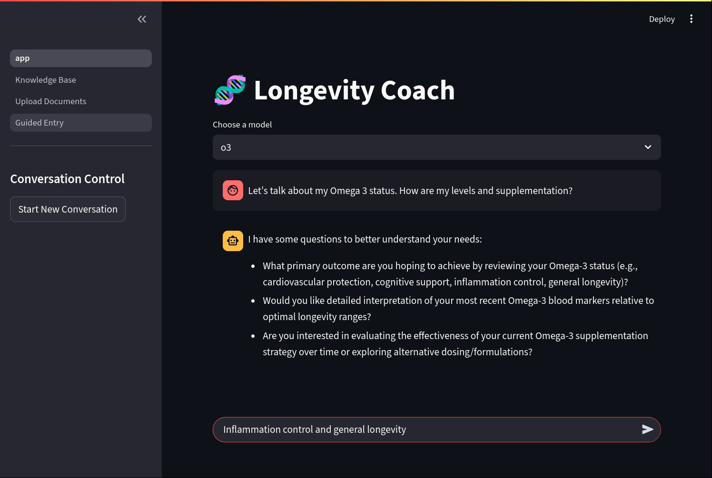
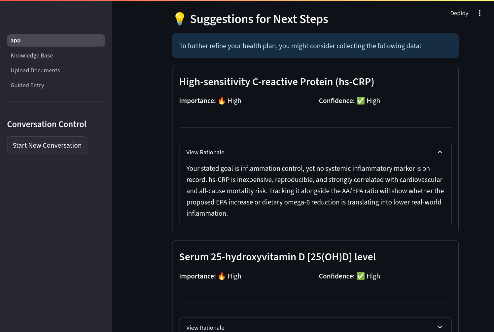

# Advanced RAG-Powered Longevity Coach

This project implements a Retrieval-Augmented Generation (RAG) chatbot that delivers personalized health and longevity advice. The application has evolved into a comprehensive knowledge management tool, featuring multiple ways for users to interact with and curate the data that informs the AI's responses.

## Overview

- **Streamlit Frontend:** The user interface is built with Streamlit, providing a main chat interface and separate pages for knowledge management.
- **Hybrid Search Retrieval:** The core of the chatbot combines keyword-based (BM25) and semantic (FAISS) search to retrieve highly relevant context from the knowledge base.
- **Interactive Knowledge Base:** A dedicated page allows users to directly view, edit, add, and delete all data in the knowledge store using a spreadsheet-like interface.
- **Multiple Data Ingestion Methods:**
    - **PDF Upload:** Automatically processes uploaded PDF documents (e.g., lab reports), extracts text, and uses an LLM to convert it into structured knowledge base entries.
    - **Guided Conversational Entry:** A chat-based interface where an AI assistant helps the user create new, correctly formatted data entries.
- **Transparent Processing:** The UI provides real-time feedback during complex operations, showing the user exactly what the system is doing as it plans searches or processes documents.

## How It Works

The application is now split into two primary workflows: chatting with the coach and managing the knowledge base.

### Workflow 1: Chatting with the Coach

1.  **User Interaction via Streamlit:**  
    Users ask health or longevity questions in the main chat interface.

2.  **Developing a Search Strategy:**  
    The chatbot analyzes the query to determine which pieces of information are most relevant. For example, if the user asks about managing heart disease risk, the chatbot will plan to search for relevant genetic markers, lab results, and supplements.

3.  **Hybrid Context Retrieval:**  
    The system uses a powerful two-pronged approach to find the best information:
    -   **Keyword Search (BM25):** Finds documents containing exact term matches, ensuring precision.
    -   **Semantic Search (FAISS):** Finds conceptually related documents, capturing user intent even without specific keywords.
    -   The results from both searches are intelligently fused to create a final, highly relevant ranking of documents to use as context.

4.  **Generating the Response:**  
    The filtered, relevant information is combined with the original query and passed to the LLM, which generates an accurate and relevant response. The user can view the "thought process" in real-time.

### Workflow 2: Managing the Knowledge Base

1.  **PDF Upload & Automated Structuring:**  
    A user can upload a PDF. The system extracts the text and uses an LLM to parse it into one or more structured JSON entries, which are then added to the knowledge base.

2.  **Guided Conversational Entry:**  
    A user can talk to a data entry assistant. The assistant asks questions and uses the user's natural language descriptions to generate a structured JSON entry, which the user then confirms before it's saved.

3.  **Direct Data Editing:**  
    Users can navigate to the "Knowledge Base" page to see all data in a spreadsheet-like table. They can directly edit cells, add new rows, or delete existing entries.

4.  **Automatic Re-indexing:**  
    Whenever the knowledge base is updated through any of these methods, the system automatically purges the old search index and re-builds it from scratch. This ensures all changes are immediately reflected in the chatbot's retrieval process.

## Benefits of This Approach

- **Enhanced Relevance and Accuracy:**  
  Hybrid search combines the strengths of keyword and semantic search, leading to better context and more accurate answers.

- **User Control and Trust:**  
  By allowing users to view, edit, and curate the knowledge base, the application fosters transparency and gives them ultimate control over the AI's knowledge source.

- **Scalability and Flexibility:**  
  The system can be extended with new information from various sources (PDFs, user knowledge) and efficiently scales by retrieving only the most pertinent details for any given query.

## Screenshots

## Conclusion

The RAG-powered longevity coach has evolved into an interactive and powerful knowledge management system. It not only tailors its responses by fetching the most relevant data but also empowers the user to curate and expand that knowledge base through intuitive interfaces. This creates a more accurate, transparent, and personalized user experience.
