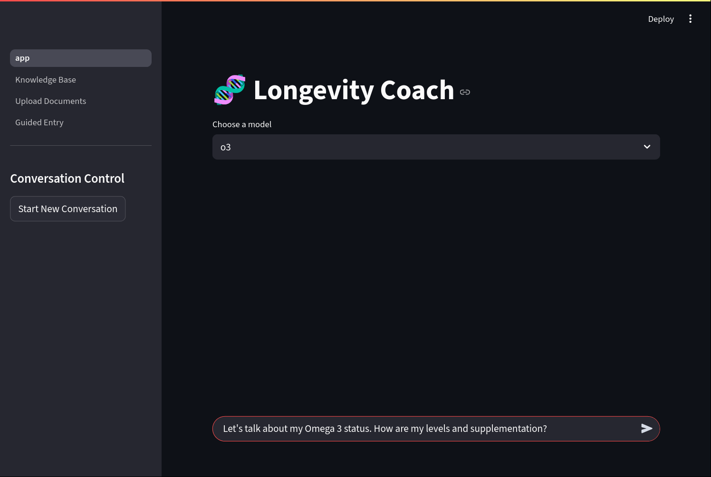
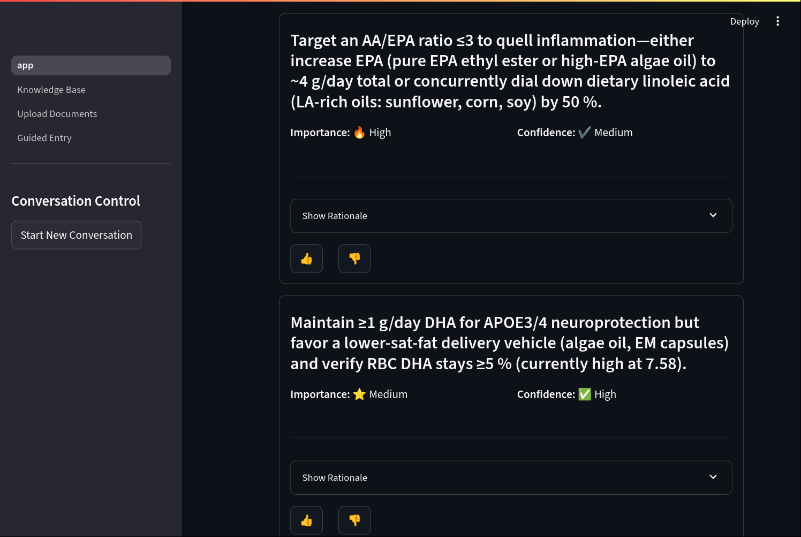

# 🧬 Longevity Coach: Personalized Health Insights

This project is an advanced, AI-powered longevity coach that provides personalized health insights through a conversational interface. It leverages a sophisticated Retrieval-Augmented Generation (RAG) system, a comprehensive knowledge management suite, and a multi-step dialogue flow to deliver tailored advice based on user-provided data and a curated knowledge base.

## Overview

The application is structured as a multi-page Streamlit app with two primary user workflows:

1.  **Conversational Coaching:** A chat interface where users can ask health-related questions, and the AI coach engages in a dialogue to understand their needs before providing detailed, evidence-backed insights.
2.  **Knowledge Management:** A suite of tools that allow users to build, manage, and curate the knowledge base that the AI relies on, ensuring transparency, accuracy, and personalization.

Key features include:
- **Streamlit Frontend:** A clean, interactive user interface.
- **Conversational AI Flow:** A multi-step process involving clarifying questions to better understand the user's context.
- **Hybrid Search Retrieval:** A sophisticated search system combining semantic (FAISS) and keyword-based (BM25) search with Reciprocal Rank Fusion (RRF) to ensure the most relevant context is found.
- **Comprehensive Knowledge Management:** Multiple ways to manage the knowledge base: direct editing, PDF document uploads, and a guided, chat-based entry system.
- **Powered by LLMs:** Utilizes powerful language models for understanding user intent, generating questions, and synthesizing insights.

## How It Works

### Workflow 1: Chatting with the Coach

The primary user interaction is a conversation with the Longevity Coach. This workflow is designed to deeply understand the user's needs before providing insights.

1.  **Initial User Query:** The user starts by asking a question or stating a health goal in the main chat interface.
2.  **Clarifying Questions:** Instead of answering immediately, the AI analyzes the initial query and generates a set of clarifying questions to gather more specific context and better understand the user's situation.
3.  **User Answers:** The user provides answers to the clarifying questions.
4.  **Hybrid Context Retrieval:** The system plans a search strategy and uses a powerful hybrid search approach to find the most relevant information from its knowledge base.
    -   **Keyword Search (BM25):** Finds documents with exact term matches.
    -   **Semantic Search (FAISS):** Finds conceptually related documents.
    -   **Reciprocal Rank Fusion (RRF):** The results from both searches are intelligently fused to create a final, highly relevant ranking of documents to use as context.
5.  **Insight Generation:** The retrieved context, along with the full conversation history (initial query + answers), is passed to a large language model, which synthesizes a set of personalized insights. These insights are presented with ratings for importance and confidence, and include a rationale and a summary of the supporting data.

### Workflow 2: Managing the Knowledge Base

A key feature of this application is the ability for users to have full control over the AI's knowledge. The `pages` directory contains several tools for this purpose.

1.  **Direct Knowledge Base Editing:** Users can navigate to the "Knowledge Base" page to view all data in a spreadsheet-like table. They can directly edit, add new rows, or delete entries. Changes are saved and the search index is rebuilt automatically.
2.  **PDF Upload & Automated Structuring:** A user can upload a PDF (e.g., a lab report). The system extracts the text and uses an LLM to parse it into one or more structured JSON entries, which are then added to the knowledge base.
3.  **Guided Conversational Entry:** A user can chat with a data entry assistant. The assistant asks questions and uses the user's natural language descriptions to generate a structured JSON entry, which the user then confirms before it's saved.

## Getting Started

1.  **Prerequisites:**
    - Python 3.8+
    - An OpenAI API key

2.  **Installation:**
    ```bash
    # Clone the repository
    git clone <repository_url>
    cd <repository_directory>

    # Install dependencies
    pip install -r requirements.txt
    ```

3.  **Environment Variables:**
    Create a `.env` file in the root directory and add your OpenAI API key:
    ```
    OPENAI_API_KEY="sk-..."
    ```

4.  **Running the Application:**
    ```bash
    streamlit run app.py
    ```
    The application will be available at `http://localhost:8501`.

<<<<<<< Updated upstream
## Screenshots








=======
## Project Structure
>>>>>>> Stashed changes

```
.
├── app.py                   # Main Streamlit application (chat interface)
├── coach/
│   ├── longevity_coach.py   # Core logic for the coach
│   ├── search.py            # Search strategy and context retrieval
│   ├── vector_store.py      # Hybrid search implementation (FAISS + BM25)
│   ├── prompts.py           # Prompts for the LLMs
│   └── ...
├── pages/
│   ├── 1_Knowledge_Base.py  # UI for direct knowledge base editing
│   ├── 2_Upload_Documents.py# UI for PDF uploads
│   └── 3_Guided_Entry.py    # UI for conversational data entry
├── docs.jsonl               # The knowledge base file
├── vector_store_data/       # Directory for the persisted vector store
├── requirements.txt         # Python dependencies
└── README.md                # This file
```

## Conclusion

The RAG-powered longevity coach has evolved into an interactive and powerful knowledge management system. It not only tailors its responses by fetching the most relevant data but also empowers the user to curate and expand that knowledge base through intuitive interfaces. This creates a more accurate, transparent, and personalized user experience.
