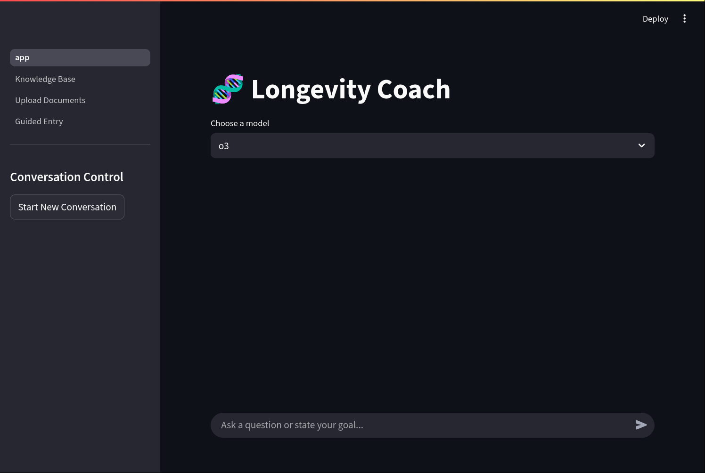

# RAG-Powered LLM Longevity Coach

This project implements a Retrieval-Augmented Generation (RAG) chatbot that delivers personalized health and longevity advice. The chatbot leverages both a large language model (LLM) and a vector-based retrieval system to ensure that only the most relevant user data is used to generate responses.

## Overview

- **Streamlit Frontend:** The user interface is built with Streamlit, which handles input/output and displays the chatbot’s conversation along with intermediate steps.
- **Context Retrieval:** When a query is made, the system uses RAG to fetch relevant information from a large repository of health data (e.g., genetic variants, lab results, supplement details). This means only the necessary context is passed to the LLM.
- **Cost and Accuracy:** By retrieving only the information pertinent to the user’s query, the app avoids sending an overwhelming amount of data. This prevents unnecessary token usage and minimizes the risk of diluting the LLM’s output with irrelevant details.

## How It Works

1. **User Interaction via Streamlit:**  
   Users type their health or longevity questions into a simple chat interface. For example, "What supplements should I consider taking for longevity, based on my genetics and lab results?" The application displays the chatbot's response and its intermediate "thinking" steps.

2. **Developing a Search Strategy:**  
   The chatbot analyzes the user’s query to determine which pieces of information are most relevant. For instance, it might focus on specific genetic markers, recent lab results, or particular supplements. For example, if the user asks about supplements to manage heart disease risk, the chatbot will search for genetic markers, lab results, and supplements that would either increase or decrease the risk of heart disease.

3. **Retrieving Relevant Context:**  
   Instead of retrieving a complete dump of all stored health data, the system uses the search strategy to query a FAISS-backed vector store (FAISS is an acronym for Facebook AI Similarity Search). This store can potentially contain a large amount of data, but only the relevant documents are selected. This targeted data retrieval ensures that the LLM receives only the necessary context for the query.

4. **Generating the Response:**  
   The filtered, relevant information is combined with the original query and passed to the LLM. This focused context helps the model generate an accurate and relevant response, while also conserving tokens and reducing processing costs.

## Benefits of Using RAG in This Context

- **Efficient Use of Resources:**  
  Instead of passing the entire dataset to the LLM, RAG allows the system to filter out less relevant information. This not only saves tokens but also reduces computational costs.

- **Enhanced Relevance and Accuracy:**  
  Feeding only targeted information to the LLM minimizes noise. With a focused context, the LLM is more likely to produce responses that are directly relevant to the user's specific health and longevity query.

- **Scalability with Large Datasets:**  
  Health data can be vast. RAG ensures that as more user data is added, the application scales efficiently by retrieving only the pertinent details. This approach avoids the pitfalls of overwhelming the language model with too much irrelevant context.

## Screenshots




## How to Use the Application

This project utilizes a Streamlit frontend to power the RAG-based longevity coach chatbot. The app (located in `app.py`) integrates a retrieval-augmented generation (RAG) approach with a vector store to efficiently process and respond to health and longevity queries. Follow the steps below to get started:

1. **Install Dependencies**  
   Make sure you have Python installed. Then, install the required packages:
   ```bash
   pip install -r requirements.txt
   ```

2. **Set Up Your Environment**  
   - **OpenAI API Key:**  
     Obtain an OpenAI API key from [OpenAI](https://platform.openai.com/) and set it as an environment variable:
     ```bash
     export OPENAI_API_KEY="your_openai_api_key"
     ```
   - **Optional Health Data File:**  
     Create a `docs.jsonl` based on the provided example (`docs_example.jsonl`) that contains your health data (e.g., supplements, gene variants, lab results) and place it in the project root. This file is used to generate and update the vector store with relevant documents before running the app. If you need help creating this data file, you can use an LLM with good coding skills to help you translate your information into the expected format.

3. **Launch the Application**  
   Start the Streamlit app by running:
   ```bash
   streamlit run app.py
   ```
   This command will open the Longevity Coach Chat interface in your browser.

4. **Interact with the Chatbot**  
   - **Enter Your Query:**  
     Type in your health or longevity-related question. For example:
     ```
     What supplements should I consider for longevity based on my lab results?
     ```
   - **Review the Chat History:**  
     Your question appears in the chat window.
   - **View Coach’s Thought Process:**  
     Click on the "View Coach's Thought Process" expander to see how the application constructs its search strategy and retrieves relevant context.
   - **Receive a Personalized Response:**  
     The final response, incorporating the retrieved context, is then displayed to provide detailed advice.

## Conclusion

The RAG-powered longevity coach chatbot efficiently tailors its responses by only fetching the most relevant data for each user query. This selective retrieval is critical in a domain where vast amounts of health-related data are available, such as genetic variants and lab tests. By reducing the context to what is necessary, the app not only conserves computational resources but also improves the accuracy and relevance of the responses generated by the LLM.